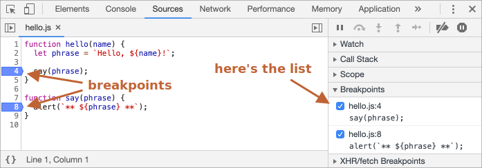
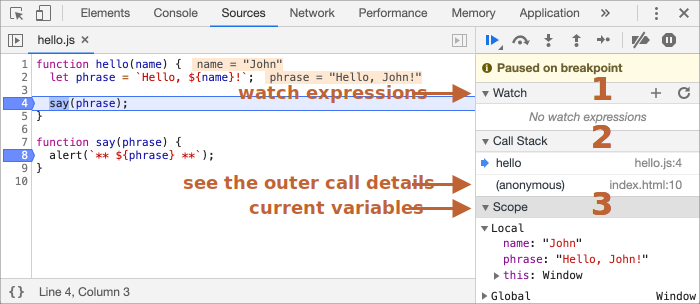

# Ladění v Chrome

Než začneme psát složitější kód, pohovořme si o ladění.

[Ladění](https://cs.wikipedia.org/wiki/Ladění_(programování)) je proces hledání a opravování chyb ve skriptu. Všechny moderní prohlížeče a většina ostatních prostředí podporují ladicí nástroje -- speciální uživatelské rozhraní ve vývojářských nástrojích, které ladění znatelně ulehčuje. Umožňuje také procházet kód krok za krokem, abychom viděli, co přesně se v něm děje.

Zde budeme používat Chrome, protože má dostatek vlastností. Většina ostatních prohlížečů má podobný proces.

## Panel „Zdroje“

Vaše verze Chrome může vypadat trochu odlišně, ale i tak by mělo být zřejmé, o co jde.

- Otevřete v Chrome [stránku s příkladem](debugging/index.html).
- Zapněte vývojářské nástroje klávesou `key:F12` (Mac: `key:Cmd+Opt+I`).
- Zvolte panel `Sources` (`Zdroje`).

Když to uděláte napoprvé, měli byste vidět toto:


Přepínač <span class="devtools" style="background-position:-172px -98px"></span> otevírá záložku se soubory.

Klikněme na něj a a zvolme `hello.js` v zobrazení stromu. Mělo by se zobrazit toto:


Panel Sources má 3 části:

1. Záložka **File Navigator** zobrazuje soubory HTML, JavaScript, CSS a jiné, včetně obrázků, které jsou připojeny ke stránce. Zde se mohou objevit i rozšíření Chrome.
2. Záložka **Code Editor** zobrazuje zdrojový kód.
3. Záložka **JavaScript Debugging** slouží k ladění. Brzy ji prozkoumáme.

Nyní můžete kliknout na stejný přepínač <span class="devtools" style="background-position:-172px -122px"></span> znovu, abyste skryli seznam zdrojů a poskytli prostor kódu.

## Konzole

Pokud stiskneme `key:Esc`, otevře se dole konzole. Můžeme tam psát příkazy, které se po stisknutí `key:Enter` vykonají.

Poté, co se příkaz vykoná, se dole zobrazí jeho výsledek.

Například `1+2` zde vydá výsledek `3` a `hello("debugger")` nevrátí nic, takže výsledek bude `undefined`:


## Breakpointy

Nyní prozkoumáme, co se přesně děje v kódu na [stránce s příkladem](debugging/index.html). V `hello.js` klikněte na číslo řádku `4`. Ano, přímo na číslici `4`, ne na kód.

Gratulujeme! Právě jste nastavili breakpoint. Klikněte prosím také na číslo řádku `8`.

Mělo by to vypadat takto (modrá barva označuje, kam byste měli kliknout):



*Breakpoint* je bod, v němž debugger automaticky pozastaví výkon JavaScriptu.

Když je kód pozastaven, můžeme prozkoumávat aktuální proměnné, spouštět příkazy v konzoli apod. Jinými slovy, můžeme kód ladit.

V pravém panelu vždy najdeme seznam breakpointů. To je užitečné, když máme mnoho breakpointů v různých souborech. Umožňuje nám:
- Rychle přeskočit na breakpoint v kódu (kliknutím na něj v pravém panelu).
- Dočasně breakpoint zrušit tím, že jej odškrtneme.
- Odstranit breakpoint tím, že na něj klikneme pravým tlačítkem myši a zvolíme Remove.
- ...A tak dále.

```smart header="Podmíněné breakpointy"
*Kliknutím pravým tlačítkem* na číslo řádku můžeme vytvořit *podmíněný* breakpoint. Ten se aktivuje, jen když je splněna zadaná podmínka.

To se hodí, když potřebujeme zastavit skript jen při určité hodnotě proměnné nebo pro určité parametry funkce.
```

## Příkaz debugger

Pozastavit kód můžeme také tím, že v něm použijeme příkaz `debugger`, například:

```js
function ahoj(jméno) {
  let věta = `Ahoj, ${jméno}!`;

*!*
  debugger;  // <-- debugger se tady zastaví
*/!*

  řekni(věta);
}
```

To je velmi užitečné, když se nacházíme v editoru kódu a nechceme se přepínat do prohlížeče a hledat skript ve vývojářských nástrojích, abychom nastavili breakpoint.


## Pozastavení a rozhlédnutí

V našem příkladu bylo během nahrání stránky zavoláno `hello()`, takže nejjednodušším způsobem, jak aktivovat debugger (po nastavení breakpointů), je znovu načíst stránku. Stiskneme tedy `key:F5` (Windows, Linux) nebo `key:Cmd+R` (Mac).

Když je breakpoint nastaven, výkon se pozastaví na 4. řádku:



Prosíme otevřete si informační dropdowny vpravo (označené šipkami), které vám umožní prozkoumávat aktuální stav kódu:

1. **`Watch` -- zobrazí aktuální hodnotu jakéhokoli výrazu.**

    Můžete kliknout na plus `+` a zadat výraz. Debugger bude vždy zobrazovat jeho hodnotu, kterou při výkonu skriptu automaticky přepočítá.

2. **`Call Stack` -- zobrazí řetězec vnořených volání funkcí.**

    V aktuálním okamžiku je debugger uvnitř volání `hello()`, kterou zavolal skript v `index.html` (není zde žádná funkce, takže se nazývá „anonymní“).

    Když kliknete na prvek zásobníku (např. „anonymní“), debugger přeskočí na odpovídající kód a vy můžete prozkoumávat jeho proměnné.
    
3. **`Scope` -- aktuální proměnné.**

    `Local` zobrazuje lokální funkční proměnné. Vidíte také jejich hodnoty zvýrazněné přímo nad zdrojovým kódem.

    `Global` obsahuje globální proměnné (mimo všechny funkce).

    Je zde také klíčové slovo `this`, které jsme zatím nestudovali, ale brzy tak učiníme.

## Sledování výkonu skriptu

Nyní nastal čas *trasovat* skript.

K tomu slouží tlačítka na vrchu pravého panelu. Podívejme se na ně.
<!-- https://github.com/ChromeDevTools/devtools-frontend/blob/master/front_end/Images/src/largeIcons.svg -->
<span class="devtools" style="background-position:-146px -168px"></span> -- "Resume": continue the execution, hotkey `key:F8`.
: Resumes the execution. If there are no additional breakpoints, then the execution just continues and the debugger loses control.

    Here's what we can see after a click on it:

    

    The execution has resumed, reached another breakpoint inside `say()` and paused there. Take a look at the "Call Stack" at the right. It has increased by one more call. We're inside `say()` now.

<span class="devtools" style="background-position:-200px -190px"></span> -- "Step": run the next command, hotkey `key:F9`.
: Run the next statement. If we click it now, `alert` will be shown.

    Clicking this again and again will step through all script statements one by one.

<span class="devtools" style="background-position:-62px -192px"></span> -- "Step over": run the next command, but *don't go into a function*, hotkey `key:F10`.
: Similar to the previous the "Step" command, but behaves differently if the next statement is a function call. That is: not a built-in, like `alert`, but a function of our own.

    The "Step" command goes into it and pauses the execution at its first line, while "Step over" executes the nested function call invisibly, skipping the function internals.

    The execution is then paused immediately after that function.

    That's good if we're not interested to see what happens inside the function call.

<span class="devtools" style="background-position:-4px -194px"></span> -- "Step into", hotkey `key:F11`.
: That's similar to "Step", but behaves differently in case of asynchronous function calls. If you're only starting to learn JavaScript, then you can ignore the difference, as we don't have asynchronous calls yet.

    For the future, just note that "Step" command ignores async actions, such as `setTimeout` (scheduled function call), that execute later. The "Step into" goes into their code, waiting for them if necessary. See [DevTools manual](https://developers.google.com/web/updates/2018/01/devtools#async) for more details.

<span class="devtools" style="background-position:-32px -194px"></span> -- "Step out": continue the execution till the end of the current function, hotkey `key:Shift+F11`.
: Continue the execution and stop it at the very last line of the current function. That's handy when we accidentally entered a nested call using <span class="devtools" style="background-position:-200px -190px"></span>, but it does not interest us, and we want to continue to its end as soon as possible.

<span class="devtools" style="background-position:-61px -74px"></span> -- enable/disable all breakpoints.
: That button does not move the execution. Just a mass on/off for breakpoints.

<span class="devtools" style="background-position:-90px -146px"></span> -- enable/disable automatic pause in case of an error.
: When enabled, and the developer tools is open, a script error automatically pauses the execution. Then we can analyze variables to see what went wrong. So if our script dies with an error, we can open debugger, enable this option and reload the page to see where it dies and what's the context at that moment.

```smart header="Continue to here"
Right click on a line of code opens the context menu with a great option called "Continue to here".

That's handy when we want to move multiple steps forward to the line, but we're too lazy to set a breakpoint.
```

## Logging

To output something to console from our code, there's `console.log` function.

For instance, this outputs values from `0` to `4` to console:

```js run
// open console to see
for (let i = 0; i < 5; i++) {
  console.log("value,", i);
}
```

Regular users don't see that output, it is in the console. To see it, either open the Console panel of developer tools or press `key:Esc` while in another panel: that opens the console at the bottom.

If we have enough logging in our code, then we can see what's going on from the records, without the debugger.

## Summary

As we can see, there are three main ways to pause a script:
1. A breakpoint.
2. The `debugger` statements.
3. An error (if dev tools are open and the button <span class="devtools" style="background-position:-90px -146px"></span> is "on").

When paused, we can debug - examine variables and trace the code to see where the execution goes wrong.

There are many more options in developer tools than covered here. The full manual is at <https://developers.google.com/web/tools/chrome-devtools>.

The information from this chapter is enough to begin debugging, but later, especially if you do a lot of browser stuff, please go there and look through more advanced capabilities of developer tools.

Oh, and also you can click at various places of dev tools and just see what's showing up. That's probably the fastest route to learn dev tools. Don't forget about the right click and context menus!
